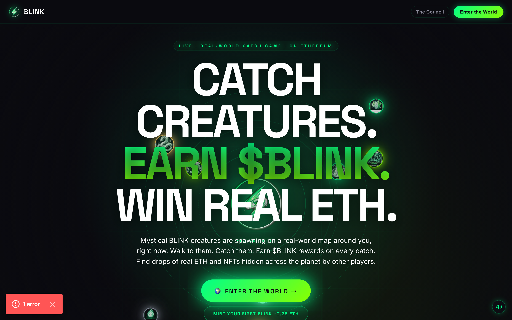
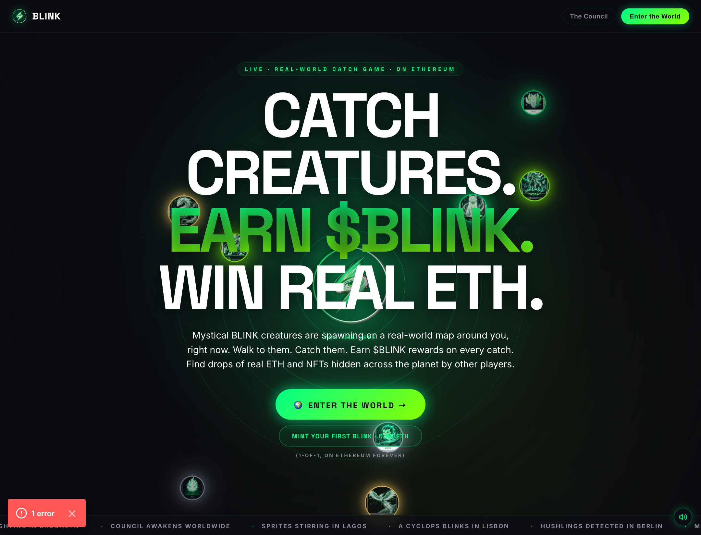
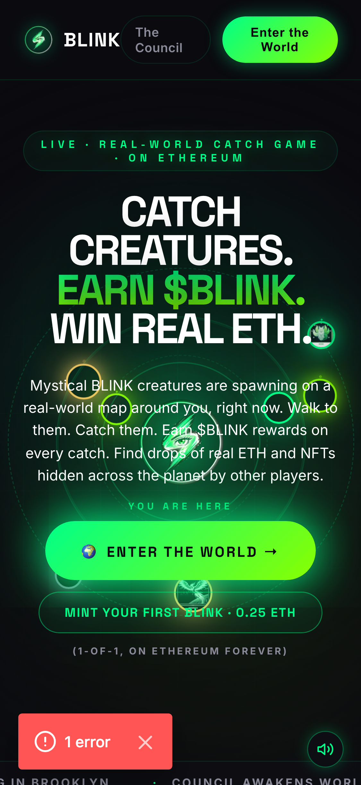

# BLINK Phase 6 — "Landing Reborn" · Changelog

> "When a stranger lands on blinkworld.xyz, within 5 seconds they should
> understand: there is a game where I catch creatures in the real world, and
> I get paid in crypto for doing it."

Phase 6 reframes the landing page from mystical lore drop → hit game site,
keeping the BLINK aesthetic and pushing the lore where it belongs (signin,
creature modals, Eye Speaks). Mainnet contracts were not touched — the
$BLINK ERC-20 (`0xe7BF94959b0bfa8CB9e61149de5BFb387B40761B`) and the
BLINK Genesis NFT (`0x85e7CB56fA10f26fEAe20449e71AD1503867799A`) are
referenced but not modified.

---

## New components

| File | What it is |
|---|---|
| `src/components/HeroMapPreview.tsx` | The animated "mini-map" hero backdrop. Pure CSS keyframes: rotating ring grid, pulsing "YOU ARE HERE" eye, three concentric orbits with 8 creatures (Sprite, Cyclops, Cat, Phoenix, Oracle, Aethermane, Emberling, Whiskerwisp), pinging radar circles, hex-grid bg, vignette. Respects `prefers-reduced-motion`. Lazy-mounts after first paint. |
| `src/components/landing/Hero.tsx` | The new hero section. Three-line stacked headline (CATCH CREATURES / EARN $BLINK / WIN REAL ETH) with a green gradient on the middle line. Primary CTA `🌍 ENTER THE WORLD →` routes to `/map` if a wallet is connected (via wagmi `useAccount`), otherwise `/auth/signin`. Secondary CTA links to `https://mintmyblink.com` in a new tab. Floor: poetic non-numeric ticker. |
| `src/components/landing/HowItWorks.tsx` | Three big cards directly below the hero: **WATCH · HUNT · CATCH**. Each card animates a small floating icon. Hover/focus shows a pulse + green border. Replaces the old "Watch / Approach / Witness" mystic version. |
| `src/components/landing/TwoWaysToEarn.tsx` | Side-by-side cards. **💎 EARN $BLINK** shows the rarity reward tiers (Common 10 → Mythic 10,000) with bonus list and a link to the $BLINK contract on Etherscan. **💰 FIND REAL ETH** lists drop properties with a sample preview ("0.05 ETH · Brooklyn Bridge") and a "Hide a treasure →" CTA pointing at `/drop` (built in 6b). |
| `src/components/landing/MintFoundersCTA.tsx` | Mid-page recruiter card just above the Bestiary. Pitches the 20 Founders, lifetime 2x earnings, 1-of-1, 0.25 ETH. MINT NOW → `mintmyblink.com`; Browse → OpenSea. Four staggered floating portrait tiles (Sprite, Cyclops, Oracle, Phoenix). |

---

## Voice softening

| Old | New | Where |
|---|---|---|
| `Enter The Eye` (hero) | `🌍 ENTER THE WORLD →` (with conditional wallet-aware routing) | Hero CTA |
| `Enter The Eye` (nav) | `Enter the World` | Top nav button |
| `Enter The Eye` (final CTA) | `🌍 Enter the World →` | Bottom final CTA |
| `The Eye sees you. / Now see back.` | `The world is full of creatures. / Go catch one.` | Final-CTA headline |
| `Don't blink. The Eye is open.` (footer) | `Your BLINKS live with your wallet — forever.` | Footer tagline |
| `The Bestiary` (eyebrow) | `Meet the 20 Founders` | Bestiary eyebrow |

Lore stays where it earns its keep:

- Signin (`/auth/signin`) — *"Don't blink. The Eye is open."* — the right vibe for a wallet gate.
- Creature modals — *"A spark wearing the shape of a creature."* etc.
- The Eye Speaks section — Telegram mystical capstone.
- The Council (existing page).

---

## Page order (top → bottom)

1. Hero (animated mini-map · three-line headline · primary/secondary CTAs · ticker)
2. How It Works (Watch / Hunt / Catch)
3. Two Ways to Earn ($BLINK rewards · ETH treasure drops)
4. $BLINK token strip (anchors the contract claim)
5. Mint Your First BLINK (recruiter card)
6. Bestiary (eyebrow: "Meet the 20 Founders")
7. The Mythics
8. The Council
9. The Eye Speaks (Telegram bot)
10. Final CTA (mirrors the hero — "Enter the World")
11. Footer

The old inline "How It Works · Three steps. One Eye." section was removed
(merged into #2). The Phase-3-era `HeroEye` orbital component is no longer
imported from the landing page — it's still on disk for other surfaces.

---

## Mobile

- All headlines use `clamp()` so they scale 44px → 128px without overflow.
- Cards collapse to single-column at 720–820px breakpoints.
- Primary CTA `minWidth: 280px` so it doesn't shrink awkwardly.
- Hero CTA group has bottom padding so it never collides with the
  bottom-right SoundToggle from Phase 5b.
- Mini-map sizes via `vmin` units, so orbiters scale with the screen.
- `prefers-reduced-motion` collapses every animation in the new components
  (Hero, HeroMapPreview, HowItWorks, TwoWaysToEarn, MintFoundersCTA).

---

## SSR fix landed alongside

`src/lib/wagmi-config.ts` now polyfills a no-op `localStorage` on the
server (only when `window` is undefined and only when the Node-provided
stub lacks `.getItem`). RainbowKit's first render calls
`getRecentWalletIds()` which touches `localStorage.getItem`. Without the
polyfill, `next dev` and `next start` return 500 for every page locally.
Vercel's runtime already handles this — no production behavior change.

This was discovered while taking the Phase 6 screenshots below.

---

## Commits

```
e66930b fix(ssr): server-only localStorage no-op so wagmi+rainbowkit can render
9e52caf feat(phase6): soften voice + finalize page order
6caab94 feat(phase6): Mint Founders recruiter card + Bestiary eyebrow rename
d55da6c feat(phase6): Two Ways to Earn section ($BLINK rewards + ETH treasure)
e532fc8 feat(phase6): How It Works 3-step section under the hero
61369e0 feat(phase6): game-direct Hero with animated mini-map preview
```

`npm run build` is green at each commit.

---

## Screenshots (Headless Chromium · local dev build)

Captured against `next dev` via Chrome DevTools Protocol (`docs/phase6-screenshots/`).
The red "1 error" pill in the bottom-left is the standard Next.js dev-mode
warning badge and does not appear in production.

### Desktop hero — 1440 × 900



### Desktop hero — taller crop showing orbiters + ticker



### Mobile hero — 375 × 812 (iPhone X width)



---

## Not done in this phase (deliberate)

- `/drop` page — the "Hide a treasure" CTA target. Stubbed for Phase 6b.
- Real activity ticker (`127 BLINKS caught today`) — still poetic.
  Wire-in is trivial once `/api/activity/live` ships.
- Lighthouse on mobile — local dev wagmi/rainbowkit warm-up makes the
  number unrepresentative; should be re-measured on a Vercel preview.
- Removal of unused old `HeroEye` component — kept on disk for now in
  case other surfaces still want orbital eye iconography.

---

## Done means (check)

- [x] New Hero with animated mini-map preview
- [x] New How It Works 3-step section
- [x] New Two Ways to Earn section
- [x] New Mint Your First BLINK recruiter card mid-page
- [x] Voice softened where called for; lore preserved on signin / lore surfaces
- [x] Page re-ordered per spec
- [x] Mobile slaps (375 px shot embedded above)
- [x] Build green at each major commit
- [x] Each major piece committed separately
- [x] BLINK_PHASE6_CHANGELOG.md (this file)
